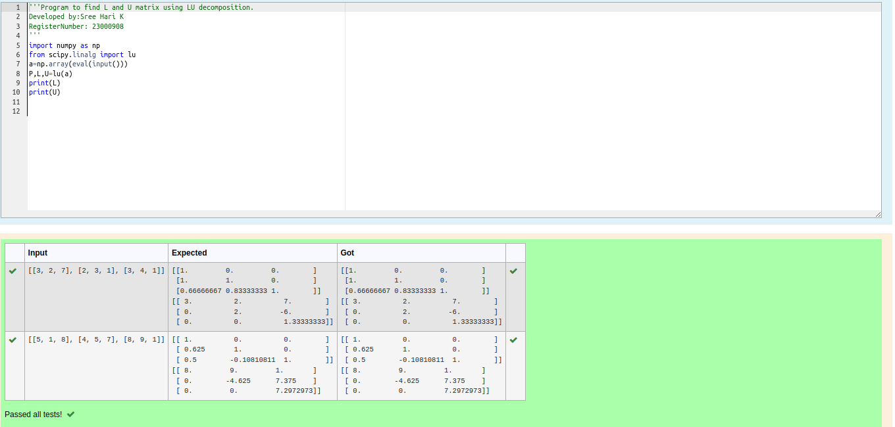
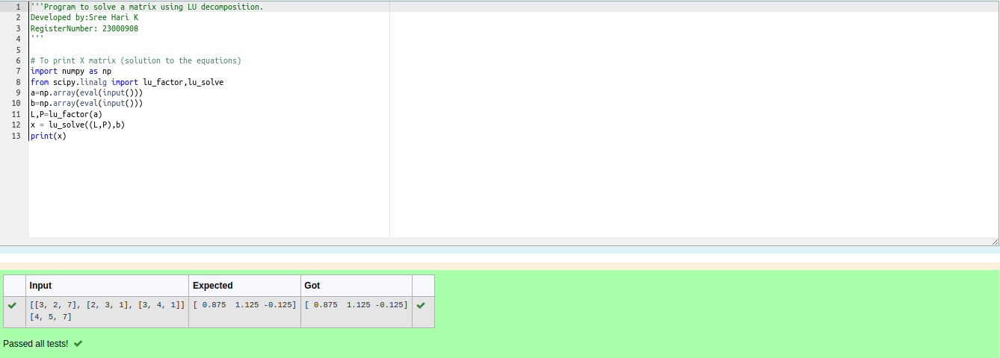

# LU Decomposition 

## AIM:
To write a program to find the LU Decomposition of a matrix.

## Equipments Required:
1. Hardware – PCs
2. Anaconda – Python 3.7 Installation / Moodle-Code Runner

## Algorithm
1. Import the numpy module and scipy.linalg module to use the built-in functions for calculation.
2. Prepare the lists from each linear equations and assign in np.array()
3. Perform scipy.linalg.lu() to find the pivot table, lower traingle and upper triangle matrix.
4. End the Program. 

## Program:
(i) To find the L and U matrix
```python
'''Program to find L and U matrix using LU decomposition.
Developed by:Sree Hari K 
RegisterNumber: 23000908
'''
import numpy as np
from scipy.linalg import lu
a=np.array(eval(input()))
P,L,U=lu(a)
print(L)
print(U)


```
(ii) To find the LU Decomposition of a matrix
```python
'''Program to solve a matrix using LU decomposition.
Developed by:Sree Hari K 
RegisterNumber: 23000908
'''

# To print X matrix (solution to the equations)
import numpy as np
from scipy.linalg import lu_factor,lu_solve
a=np.array(eval(input()))
b=np.array(eval(input()))
L,P=lu_factor(a)
x = lu_solve((L,P),b)
print(x)

```

## Output:




## Result:
Thus the program to find the LU Decomposition of a matrix is written and verified using python programming.

